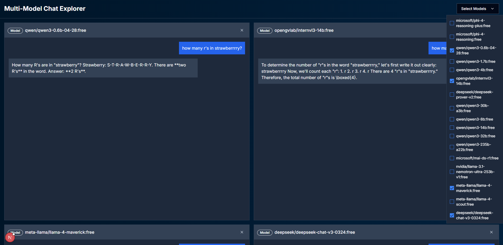

# Multi-Model Chat App



A web application for interacting with multiple AI models via a chat interface. The project consists of a Python backend API and a React/Next.js frontend.

---

## Project Structure

```
MultiModel_ChatApp/
│
├── API/                  # Python FastAPI backend
│   ├── app.py
│   └── requirements.txt
│
└── multi-model-chat/     # Next.js React frontend
    ├── package.json
    └── ...
```

---

## Backend API

### Setup

1. **Navigate to the API directory:**
   ```bash
   cd API
   ```

2. **Install dependencies:**
   ```bash
   pip install -r requirements.txt
   ```

3. **Run the API server:**
   ```bash
   python app.py
   ```

   The API should now be running (typically on `http://localhost:8000`).

---

## Frontend UI

### Setup

1. **Navigate to the frontend directory:**
   ```bash
   cd multi-model-chat
   ```

2. **Install dependencies (force flag to resolve any conflicts):**
   ```bash
   npm install --force
   ```

3. **Build the frontend:**
   ```bash
   npm run build
   ```

4. **Start the frontend server:**
   ```bash
   npm start
   ```

   The UI should now be accessible (typically on `http://localhost:3000`).

---

## Usage

- Open your browser and go to the frontend URL.
- Interact with the chat interface, which communicates with the backend API.

---

## Notes

- Ensure the backend API is running before starting the frontend UI.
- For development, you can use `npm run dev` in the frontend directory for hot-reloading.

---

## Troubleshooting

- If you encounter dependency issues in the frontend, try deleting `node_modules` and `package-lock.json` before running `npm install --force` again.
- For Python environment issues, consider using a virtual environment.

---

## License

This project is for educational and research purposes.